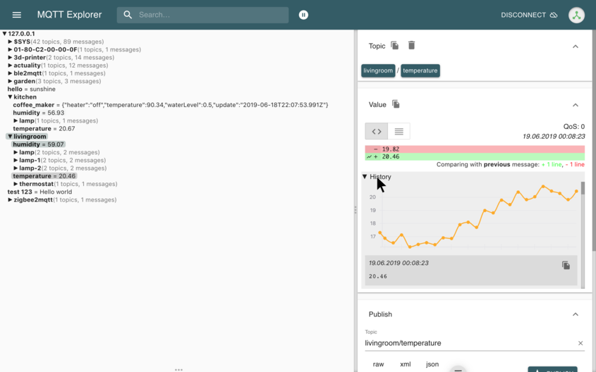
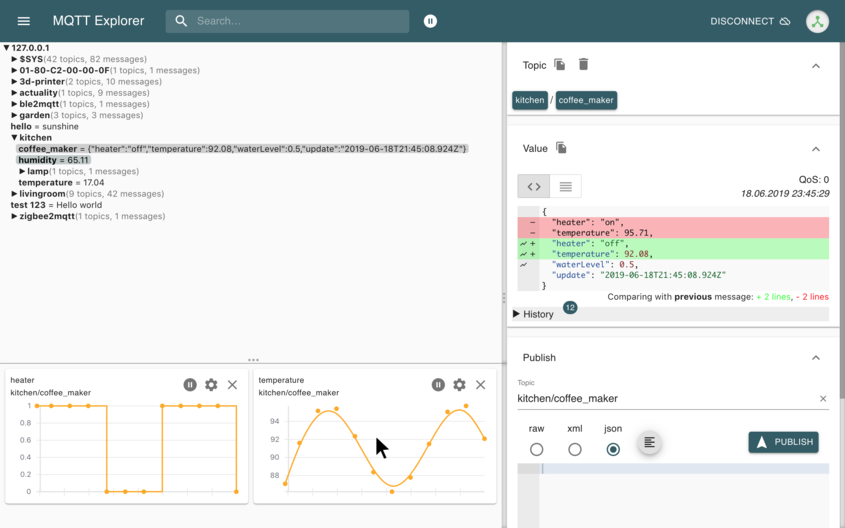
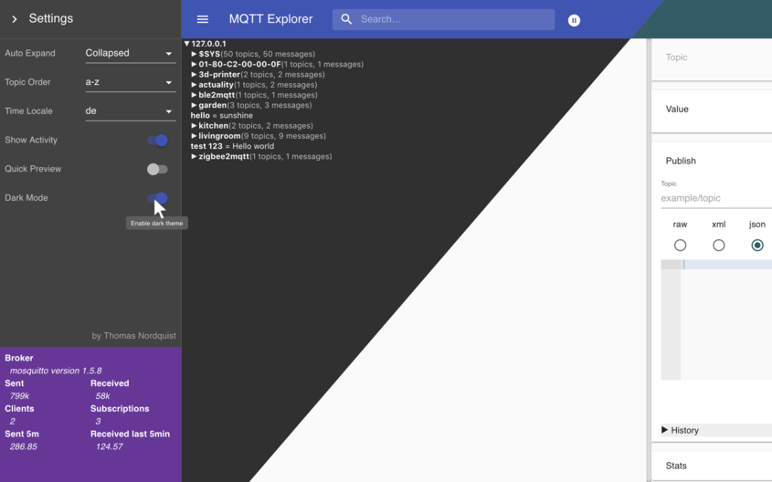

<ol class="carousel-indicators">
<li data-target="#carouselExampleIndicators" data-slide-to="0" class="active"></li>
<li data-target="#carouselExampleIndicators" data-slide-to="1"></li>
<li data-target="#carouselExampleIndicators" data-slide-to="2"></li>
</ol>

<a class="carousel-control-prev" href="#carouselExampleIndicators" role="button" data-slide="prev">

Previous
</a>
<a class="carousel-control-next" href="#carouselExampleIndicators" role="button" data-slide="next">

Next
</a>

  
  
  

## Version 0.4.0-beta4

MQTT Explorer is a comprehensive MQTT client that provides a structured overview of your MQTT topics and makes working with devices/services on your broker dead-simple.

### Features

- Visualize topics and topic activity
- Delete retained topics
- Search/filter topics
- Delete topics recursively
- Diff view of current and previous received messages
- Publish topics
- Plot numeric topics
- Retain a history of each topic
- Dark/Light Themes
- ... [See Changelog to see all features](./Changelog)

The hierarchical view makes this tool so easy to use and differentiates the **MQTT Explorer** from other great MQTT clients like [MQTTLens](https://chrome.google.com/webstore/detail/mqttlens/hemojaaeigabkbcookmlgmdigohjobjm), [MQTTBox](http://workswithweb.com/mqttbox.html) and [MQTT.fx](https://mqttfx.jensd.de/).  
This MQTT Client strives to be a MQTT swiss-army-knife, the perfect tool to integrate new services and IoT devices on your network.

## Download

Developing this tool takes a lot of effort, sweat and time, please consider rating the App on the Windows or Mac app store .  
If you feel like a feature is missing or you found a bug, please leave me a [comment / issue](https://github.com/thomasnordquist/MQTT-Explorer/issues) and I'll see what I can do.

| Platform | | Downloads |
|:----------:|:-------------:|:------:|
|  | **Windows** |  **[portable](https:&#x2F;&#x2F;github.com&#x2F;thomasnordquist&#x2F;MQTT-Explorer&#x2F;releases&#x2F;download&#x2F;0.4.0-beta4&#x2F;MQTT-Explorer-0.4.0-beta4.exe), [installer](https:&#x2F;&#x2F;github.com&#x2F;thomasnordquist&#x2F;MQTT-Explorer&#x2F;releases&#x2F;download&#x2F;0.4.0-beta4&#x2F;MQTT-Explorer-Setup-0.4.0-beta4.exe)** |
|  | **Mac** |  **[Intel](https:&#x2F;&#x2F;github.com&#x2F;thomasnordquist&#x2F;MQTT-Explorer&#x2F;releases&#x2F;download&#x2F;0.4.0-beta4&#x2F;MQTT-Explorer-0.4.0-beta4.dmg), [ARM](https:&#x2F;&#x2F;github.com&#x2F;thomasnordquist&#x2F;MQTT-Explorer&#x2F;releases&#x2F;download&#x2F;0.4.0-beta4&#x2F;MQTT-Explorer-0.4.0-beta4-arm64.dmg)**   *[How to start untrusted apps](https://support.apple.com/guide/mac-help/open-a-mac-app-from-an-unidentified-developer-mh40616/mac)*|
|  | **Ubuntu** *debian, mint, neon, fedora, etc...* |  `snap install mqtt-explorer` [Ubuntu Store](snap://mqtt-explorer) |
|  | **Linux** *almost every linux* | **[AppImage](https:&#x2F;&#x2F;github.com&#x2F;thomasnordquist&#x2F;MQTT-Explorer&#x2F;releases&#x2F;download&#x2F;0.4.0-beta4&#x2F;MQTT-Explorer-0.4.0-beta4.AppImage)** *Run AppImage: Make it executable and double-click it.* |

[More Downloads](https://github.com/thomasnordquist/MQTT-Explorer/releases)

## Video

MQTT Explorer

<video style="width: 100%" autoplay muted loop>
<source type="video/mp4" src="./video.mp4">

</video>

 

## Performance

This MQTT Client is optimized to handle thousands of topics and at hundreds of thousands messages per minute.

Custom subscriptions can limit the amount of messages **MQTT Explorer** needs to process, subscriptions can be managed in the advanced connection settings.  
In very large productive environments brokers may handle an extreme load of topics, subscribing with a wildcard topic is in this scenario not advised.

## IoT Applications

List of useful IoT applications using MQTT to integrate devices / services

- [Home Assistant](https://www.home-assistant.io/) - Open source home automation gateway
- [OpenHAB](https://www.openhab.org/) - Smart Home Gateway
- [Node-RED](https://nodered.org/) - Flow-based programming for the Internet of Things
- [zigbee2mqtt](https://github.com/Koenkk/zigbee2mqtt) - A ZigBee to MQTT bridge
- [Tasmota](https://github.com/arendst/Sonoff-Tasmota) - ESP8266 firmware with MQTT support

## Feedback
<form onsubmit="if(!this.elements.noshow.value){ this.action='https://docs.google.com/forms/d/e/1FAIpQLSePeIHoZxpbB_-ku4H97go8JPhfdrlxNc-nHPGQuWB6g-U3HQ/formResponse?embedded=true' }">

### What do you like?
<textarea style="width: 100%; border-radius: 5px; box-shadow: 5px 5px;" name="entry.1944371594"></textarea>

### What can be improved?
<textarea style="width: 100%; border-radius: 5px; box-shadow: 5px 5px;" name="entry.22814098"></textarea>

### Email (optional)

<input style="padding: 8px; flex: 2; border-radius: 5px; box-shadow: 5px 5px; border: 1px solid" type="email" name="entry.2055444782" /><button type="submit" style="padding: 8px; margin-left: 16px; border: 1px solid #2879d0; border-radius: 5px; background-color: #eee; box-shadow: 5px 5px #ccc; text-align: right; color: #2879d0;">Submit</button>

<input class="noshow" name="noshow" value="">

</form>

Ideas and bugs can also be reported on [github](https://github.com/thomasnordquist/MQTT-Explorer/issues).

## Telemetry

App telemetry has been removed, we now completely rely on your bug reports to [GitHub issues](https://github.com/thomasnordquist/MQTT-Explorer/issues)
